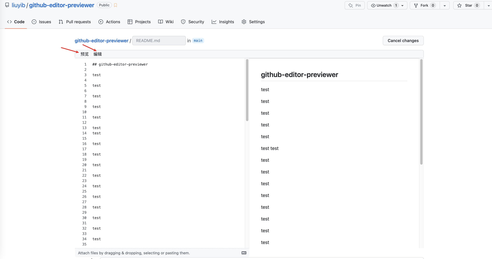

## GitHub Editor Previewer

preview your GitHub editor side-by-side

## Usage

1. Download this repo
2. follow: https://developer.chrome.com/docs/extensions/mv3/getstarted/development-basics/#load-unpacked
3. edit any file in GitHub website
4. demo:

   
